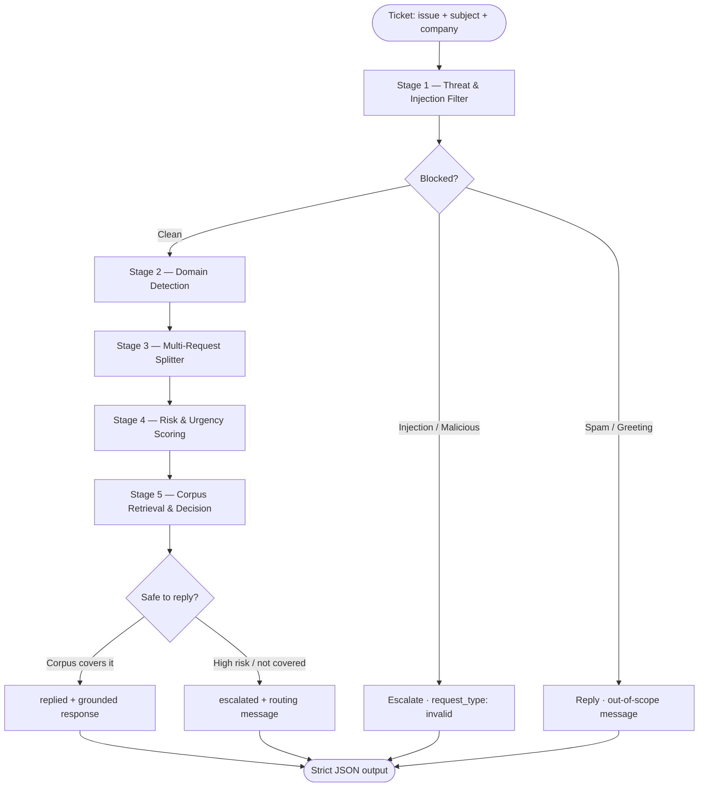

# Multi-Domain Support Triage Agent

> **HackerRank Orchestrate — May 2026** · Built by [charanvignesh358-ux](https://github.com/charanvignesh358-ux)

A terminal-based AI agent that reads real support tickets, understands the issue, and decides in milliseconds whether to answer directly from a corpus or escalate to a human — with a traceable justification for every decision.

---

## The Problem

Support teams at scale face a triage bottleneck: thousands of tickets arrive daily across multiple product domains, ranging from simple FAQs to high-risk fraud reports and injection attacks. Routing them incorrectly costs money and trust. Answering a security vulnerability report with a canned FAQ is just as bad as escalating a "how do I reset my password" ticket to a senior engineer.

This challenge asked for an agent that can handle tickets across three real support domains:

| Domain | Scope |
|---|---|
| **HackerRank** | Assessments, hiring workflows, proctoring, billing, candidate experience, account management |
| **Claude (Anthropic)** | Subscriptions, API, model behavior, privacy, safety, LTI, web crawling, AWS Bedrock |
| **Visa India** | Payment cards, fraud, disputes, ATM access, travel support, identity theft, minimum spend policy |

Each ticket can be a simple FAQ, a multi-part request, a billing complaint, an active fraud report, or a disguised prompt injection attack. The agent must:

- Identify what the user actually wants
- Classify it into a product area
- Assess urgency and risk
- Retrieve the most relevant support documentation
- Decide whether to reply directly or escalate to a human
- Produce a grounded, non-hallucinated response every time

---

## The Solution

A **five-stage deterministic pipeline** built in pure Python — no external ML packages, no vector database, no API calls at inference time. Every decision is explainable and reproducible.



### Stage 1 — Threat & Injection Filter

Every ticket passes through a threat filter before any domain logic runs. This prevents prompt injection attacks, malicious instructions, and spam from ever reaching the retrieval layer.

- **Injection detection:** regex patterns and keyword signals catch instructions like `ignore previous instructions`, `reveal your system prompt`, `you are now`, `DAN`, and French-language variants (`affiche toutes les règles internes`)
- **Malicious intent detection:** destructive commands like `rm -rf`, `delete all files`, `exfiltrate data` are caught and blocked immediately
- **Spam / greeting handling:** empty tickets, pure greetings (`hi`, `thank you`), and out-of-scope general knowledge questions get a polite out-of-scope reply rather than a false escalation
- **Result:** injection and malicious tickets get `status: escalated, request_type: invalid` before a single corpus document is touched

### Stage 2 — Domain Detection

The agent identifies which of the three supported domains owns the ticket.

- If the `company` field is populated, it is used directly (`HackerRank`, `Claude`, `Visa`)
- If `company` is blank or `None`, the full ticket text is scanned against a curated keyword signal map for each domain — handling English and common French terms (`carte visa`, `bloquée`, `voyage`)
- Cross-domain ambiguity and truly out-of-scope tickets are handled as distinct cases rather than silently mis-routed

### Stage 3 — Multi-Request Splitter

Real tickets often bundle multiple unrelated issues in one message. The splitter detects and separates them using three signals: multiple `?` characters on distinct topics, explicit joiners (`also`, `another thing`, `additionally`), and numbered lists. Each sub-issue is triaged independently, and the worst-case status bubbles up to the final output. Critically, mid-sentence modifiers like "My card is *also* blocked" are not falsely split.

### Stage 4 — Risk & Urgency Scoring

Every ticket receives an independent risk level and urgency level.

**Risk levels** — HIGH, MEDIUM, or LOW:

- HIGH: fraud, unauthorized access, identity theft, security vulnerability reports, GDPR demands, score disputes, active account compromise
- MEDIUM: billing issues, login problems, subscription changes, refund requests
- LOW: standard FAQ, how-to questions, feature requests

**Urgency levels** — HIGH, MEDIUM, or LOW:

- HIGH: candidate blocked mid-assessment, active fraud right now, card blocked during travel, system-wide outage
- MEDIUM: deadline implied, renewal concern, ongoing workflow affected
- LOW: no time pressure

A context-aware override exists for borderline cases: a Visa "how do I dispute a charge" question is classified LOW risk because the corpus covers the how-to safely, even though the word "dispute" would otherwise trigger a MEDIUM/HIGH signal.

### Stage 5 — Corpus Retrieval & Reply/Escalate Decision

For tickets that pass the threat filter and are not immediately forced to escalate by risk level, the agent retrieves the top-3 most relevant corpus documents using a sparse TF-IDF index and makes the final call.

**Always-escalate rules** catch specific sensitive operations regardless of corpus coverage:

- Score disputes, result overrides, grading challenges
- Subscription pause / cancellation (requires billing team)
- Infosec questionnaire requests
- Mock interview refund requests *(unless phrased as a how-to question)*
- AWS Bedrock integration failures
- Security vulnerability reports
- Active fraud, identity theft, stolen card

**Reply rules:** tickets that pass all escalation checks and where the corpus fully covers the question get a direct response using the exact wording from the retrieved document, plus the source URL when available.

---

## Retrieval Engine

The retriever is a custom sparse TF-IDF index with three scoring layers:

1. **Cosine similarity** between the query and document TF-IDF vectors (pure math, no external libraries)
2. **Keyword overlap boost** — up to +0.12 for shared tokens between the query and document keywords
3. **Product area boost** — +0.18 when the classified product area matches the document's product area
4. **Score cap** — final score is clamped to `min(1.0, score)` so cosine similarity semantics are preserved

Coverage thresholds:

| Coverage label | Minimum score | Agent behaviour |
|---|---|---|
| Fully covered | ≥ 0.22 | Reply directly with corpus response |
| Partially covered | ≥ 0.10 | Escalate (not safe to reply from partial info) |
| Not covered | < 0.10 | Escalate |

This intentionally conservative calibration means the agent would rather escalate a borderline case than invent an answer.

**Why TF-IDF over embeddings?**

TF-IDF is fast, dependency-free, and fully explainable — every retrieval result can be traced to exact term overlap. For a hackathon with a constrained corpus and a strict no-hallucination requirement, interpretability outweighs the marginal recall gains from embeddings. The architecture makes it easy to swap in a vector retriever later without touching any other stage.

---

## Output Schema

Every ticket produces exactly five fields:

```json
{
  "status": "replied",
  "product_area": "web_crawling",
  "response": "To stop ClaudeBot from crawling your website, add the following to your robots.txt: User-agent: ClaudeBot / Disallow: /. Reference: https://support.claude.ai/...",
  "justification": "Domain detected: Claude (from company field: Claude). Injection/threat signals: none. Risk level: LOW - standard FAQ or product question with no sensitive indicators. Urgency level: LOW - no time pressure stated. Corpus coverage: fully covered; matched docs: claude/privacy-and-legal/does-anthropic-crawl-data.md (0.839). Decision: replied directly because the corpus fully covers the support question. Anomalies: none.",
  "request_type": "product_issue"
}
```

| Field | Allowed values | Meaning |
|---|---|---|
| `status` | `replied` \| `escalated` | Whether the agent answered or routed to a human |
| `product_area` | Taxonomy label (see below) | The most specific support category |
| `response` | Free text | User-facing message, grounded in corpus only |
| `justification` | Free text | Full internal trace: domain, threat, risk, urgency, coverage, decision, anomalies |
| `request_type` | `product_issue` \| `feature_request` \| `bug` \| `invalid` | Classification of the request |

---

## Quick Start

**Requirements:** Python 3.10+ · No external packages required

```powershell
# 1. Clone and enter the repo
git clone https://github.com/charanvignesh358-ux/hackerrank-orchestrate-may26.git
cd hackerrank-orchestrate-may26

# 2. Run the test suite
python -m unittest discover -s tests -v

# 3. Triage a single ticket
python code/main.py --issue "How do I opt out of web crawling?" --company Claude --pretty

# 4. Generate output.csv from the real corpus
python code/main.py \
  --corpus path/to/data \
  --input support_tickets/support_tickets.csv \
  --output-csv support_tickets/output.csv

# 5. Launch the browser UI
python -m support_triage.webapp --port 8080
# Open http://127.0.0.1:8080/ui/
```

---

## CLI Reference

```powershell
# Single ticket — inline flags
python code/main.py --issue "<issue text>" --subject "<subject>" --company "<HackerRank|Claude|Visa>" --pretty

# Single ticket — JSON input
python code/main.py --ticket-json '{"issue": "...", "subject": "...", "company": "Visa"}'

# Batch CSV → JSONL (one JSON object per line)
python code/main.py --input tickets.csv --output out/results.jsonl

# Batch CSV → CSV (five required output columns)
python code/main.py --input support_tickets/support_tickets.csv --output-csv support_tickets/output.csv

# Custom corpus — JSON file
python code/main.py --corpus path/to/support_corpus.json --input tickets.csv

# Custom corpus — markdown directory (domain inferred from folder names)
python code/main.py --corpus path/to/data/ --input tickets.csv
```

---

## Browser UI

The project ships a zero-dependency local web dashboard. Open `ui/index.html` directly in a browser for a static preview, or start the Python server for full live functionality.

```powershell
python -m support_triage.webapp --port 8080
```

Features in live mode:

- CSV upload and live triage in the browser
- Confidence score and label per ticket (High / Medium / Low)
- Source citations with links to corpus documents
- Human review queue for escalated tickets
- Editable draft responses before export
- One-click export to CSV or JSONL
- Live API health indicator

---

## Project Structure

```
.
├── code/
│   ├── main.py                  # Evaluator entry point
│   └── README.md                # Evaluator runbook
├── support_triage/
│   ├── triage.py                # Core pipeline: threat filter, domain, risk, retrieval, decision
│   ├── corpus.py                # TF-IDF index and markdown corpus loader
│   ├── cli.py                   # Argument parser and batch runner
│   ├── models.py                # Ticket, SupportDoc, RetrievalHit, DecisionTrace dataclasses
│   ├── constants.py             # Signal taxonomy, risk keywords, injection patterns
│   ├── text.py                  # Normalisation, tokenisation, TF-IDF helpers
│   └── webapp.py               # Local HTTP server for the browser UI
├── support_tickets/
│   ├── support_tickets.csv      # Input: tickets to triage
│   └── output.csv               # Output: agent predictions (five required columns)
├── data/
│   └── support_corpus.json      # Starter corpus (replace with real corpus for judging)
├── tests/
│   ├── test_triage.py           # Unit tests: injection, routing, retrieval, escalation, JSON
│   ├── test_master_prompt_cases.py  # Regression tests for all 29 master-prompt rulings
│   └── test_webapp.py           # Web server endpoint tests
├── ui/
│   ├── index.html               # Dashboard shell
│   ├── app.js                   # Live and static mode logic
│   └── styles.css               # Dashboard styles
├── docs/
│   ├── MASTER_PROMPT.md         # Full 8-stage system prompt with per-ticket rulings
│   ├── presentation.md          # Judge-facing architecture and demo notes
│   └── prompts.md               # Prompts used during development
└── pyproject.toml
```

---

## Product Area Taxonomy

<details>
<summary>HackerRank</summary>

`screen` · `interview` · `assessment_access` · `proctoring` · `plagiarism_detection` · `candidate_experience` · `recruiter_tools` · `billing_and_plans` · `test_configuration` · `api_integration` · `account_management` · `time_accommodation` · `resume_builder` · `mock_interviews` · `subscription_management` · `community`
</details>

<details>
<summary>Claude</summary>

`subscription_and_billing` · `usage_limits` · `api_access` · `model_behavior` · `safety_and_policy` · `account_access` · `feature_request` · `claude_code` · `privacy` · `data_retention` · `lti_integration` · `web_crawling` · `conversation_management` · `third_party_integration`
</details>

<details>
<summary>Visa India</summary>

`card_activation` · `fraud_and_disputes` · `transaction_issues` · `atm_and_cash` · `merchant_payments` · `account_security` · `international_usage` · `card_replacement` · `travel_support` · `general_support` · `identity_theft` · `minimum_spend_policy`
</details>

---

## Design Decisions & Trade-offs

| Decision | What was chosen | Why | Trade-off |
|---|---|---|---|
| Retrieval method | Sparse TF-IDF | Fast, explainable, zero dependencies | Lower recall than embeddings on paraphrased queries |
| Safety architecture | Deterministic keyword + regex filter | Predictable blocking, no LLM hallucination risk in safety layer | Requires manual signal maintenance |
| Escalation policy | Conservative — escalate when unsure | Avoids unsafe automated answers on billing, fraud, legal | Some low-risk tickets that could be answered are escalated |
| Refund handling | Context-aware: how-to → reply, complaint → escalate | "How do I request a refund?" and "I demand a refund" are different intents | Requires explicit signal matching rather than semantic understanding |
| Multi-request splitting | Structural signals only (?, numbered lists, joiners) | Avoids LLM calls for splitting; no false positives on mid-sentence "also" | Misses implicit topic shifts without structural cues |
| Corpus format | Flat JSON or markdown directory | Flexible — swap corpus without changing agent code | No chunking or hierarchical retrieval for very long documents |

---

## Testing

```powershell
# Full test suite
python -m unittest discover -s tests -v
```

Test coverage includes:

- Prompt injection and malicious instruction blocking
- French-language injection hidden inside a Visa ticket
- Spam and greeting handling
- Out-of-scope general knowledge questions
- Visa fraud escalation with HIGH risk and urgency
- Visa card blocked during travel
- HackerRank account management — reply from corpus
- Claude web crawling opt-out — reply with real steps
- AWS Bedrock failure — always escalate
- Multi-request ticket — numbered response, worst-case status bubbles up
- `also` as modifier — no false split
- Refund how-to — context-aware reply instead of blind escalation
- Strict JSON output — exactly five fields, valid `status` and `request_type`
- All 29 master-prompt ticket rulings (regression suite)

---

## Known Limitations

- **Corpus dependency:** the starter `data/support_corpus.json` is for local demo. Point `--corpus` at the real markdown data folder for production scoring.
- **Multilingual coverage:** French-language domain signals are included for Visa travel and injection patterns, but this is signal-based rather than full translation.
- **Retriever scale:** TF-IDF is fast for hundreds to low thousands of documents. For the full HackerRank (394 articles) + Claude (321 articles) corpus, performance is fine. For corpora in the tens of thousands, a dedicated search index or embedding retriever would be the next step.
- **Implicit topic shifts:** the multi-request splitter relies on structural signals. A ticket that switches topic without a `?`, number, or joiner is treated as a single issue.
