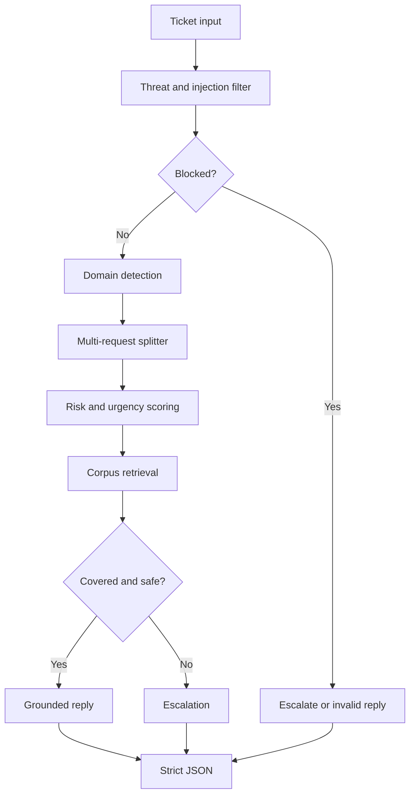

# Presentation Notes

## One-liner

A terminal-based support triage agent that routes or replies to HackerRank, Claude, and Visa India tickets using only a provided support corpus.

## Demo Flow

1. Run `python -m unittest discover -s tests`.
2. Run a safe FAQ:
   `python -m support_triage --issue "How do I opt out of web crawling?" --company Claude --pretty`
3. Run a high-risk issue:
   `python -m support_triage --issue "There is an unauthorized transaction on my Visa card right now." --company Visa --pretty`
4. Run the sample batch:
   `python -m support_triage --input data/sample_tickets.csv --output out/results.jsonl`

## Architecture

## Why This Design Wins

- Safety-first: injection and malicious instructions are blocked before any domain logic.
- Grounded: every support answer comes from the loaded corpus.
- Conservative: high-risk, high-urgency, billing action, legal/privacy, fraud, score dispute, and unsupported tickets escalate.
- Practical: no package install required, works from the terminal, handles single tickets and CSV batches.
- Testable: core behavior is covered with built-in `unittest`.

## Algorithm Choices

| Component | Choice | Why |
| --- | --- | --- |
| Retrieval | Sparse TF-IDF | Fast, explainable, dependency-free |
| Classification | Rules plus corpus matching | Transparent and easy to tune during a hackathon |
| Safety | Deterministic filters | Predictable blocking for injection and high-risk cases |
| Output | JSON / JSONL | Easy to validate and integrate |

## Trade-offs

- Keyword classification is less nuanced than a trained model.
- Starter corpus must be replaced with the official corpus for production judging.
- The built-in multilingual handling is signal-based, not full translation.
- Large corpora would benefit from a dedicated search index.

## Closing

The system is intentionally reliable under uncertainty: it answers only when the corpus supports the response and escalates when guessing would be risky.
